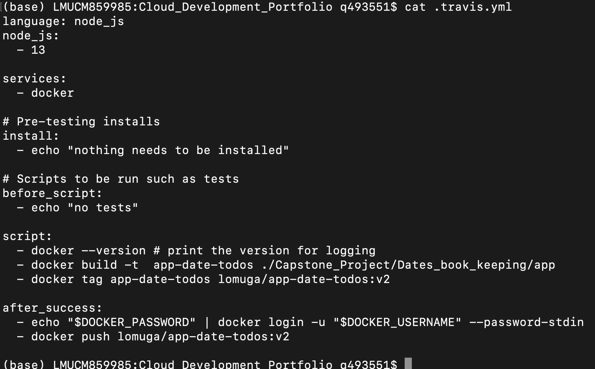

# Capstone Project: 

## Acknowledgments:

I would like to thank [Parithosh Jayanthi](https://github.com/parithosh) for his kind support during the development of this project.

## How the code is structured

### Backend

app.js - Here is all the logic. Feel free to follow the comments therein to understand the sequence of steps. It uses cookies to remember your logged-in user. It also saves data in lists.

### Frontend

Within the directory "views"

We have different .hbs files that handle different steps of the user journey.

home.hbs - it invites you to log in
login.hbs - deals with the log in  
protected - after a successful log-in, it shows the main site where you can input a date and a todo
getdata - displays the input data

## Run the app locally without docker:

	cd <folder _path>
	npm install 
	node app.js

1. 
Then use your browser to visit localhost:3000
 
2. 
It will ask you for a login, you should enter **exactly**: 
for email "user@email.com" and for password "password"

3. 
You can safelist more users in line 11 of app.js

4. 
Then the website will take you to a page to enter a date and a todo

5. 
Once you hit submit, the app will print out the list of dates and todos

6. 
To input more data, press the "back" button of your browser

## To run the app locally with **docker**:

First you need to start the docker daemon.

run in the terminal in the directory where docker-compose.yaml is:

	docker image prune --all

	docker-compose -f docker-compose-build.yaml build --parallel

	docker-compose up

Visit localhost:3000

## Continuous integration

Create a Travis account https://travis-ci.org/

Connect Travis to your GitHub and input your DocckerHub secretes (If you do not have DockerHub, kindly go ahead and create an acccount)

Take the Travis.yml file from this repo: https://github.com/gonzalo-munillag/Cloud_Development_Portfolio

Create a GitHub repo with the project (include the Travis.yml and make the corresponding changes for the path)

Pull the GitHub repo. Every time you make changes locally and you push it to GitHub, Travis will automatically build and push the docker images to your DockerHub, which will be fetched by AWS' Kubernetes

## To deploy in **AWS' Kubernetes cluster**:

Useful links:

1. 
For Kubernetes to know the docker secret, follow https://kubernetes.io/docs/tasks/configure-pod-container/pull-image-private-registry/#registry-secret-existing-credentials

2. 
To access the app in Kubernetes externally, type NodePort: https://kubernetes.io/docs/concepts/services-networking/service/#nodeport

I chose NoePort as it is an easier solution than having a reverse proxy.

3. 
Install kubectl and eksctl so that you can interact with the kubernetes cluster and deploy the cluster in one line from your terminal with:

	eksctl create cluster --name myCluster --region=us-east-1 --version=1.18 --nodes-min=2 --nodes-max=3

4. 	
In order to pull images from DockerHub inside your Kubernetes cluster, you need to add your Dockerhub credentials. Run the following:

	kubectl create secret docker-registry regcred --docker-server==https://hub.docker.com/ --docker-username=<DockerrHub_ID>--docker-password=<password> --docker-email=<your_email@whatever.com>

Note that in the file deplyoment, this has been added afetr containers:

      imagePullSecrets:
        - name: regcred
      restartPolicy: Always  
     
5. You need to deploy the different .yaml files that orchestrate the application. Go to their corresponding directories and run in the terminal:

	kubectl apply -f aws-secret.yaml
	kubectl apply -f env-configmap.yaml
	kubectl apply -f deployment.yaml
	kubectl apply -f services.yaml
	

6. Access the cluster externally

## Rolling updates

First, I changed the frontend to show this instead as a title (contains Version 2)

I had to change .travis.yml and deployment.yaml:

## Cloud watch
	
To monitor the cluster with CloudWatch, follow these steps: https://docs.aws.amazon.com/AmazonCloudWatch/latest/monitoring/Container-Insights-setup-metrics.html

	kubectl apply -f https://raw.githubusercontent.com/aws-samples/amazon-cloudwatch-container-insights/latest/k8s-deployment-manifest-templates/deployment-mode/daemonset/container-insights-monitoring/cloudwatch-namespace.yaml
	kubectl apply -f https://raw.githubusercontent.com/aws-samples/amazon-cloudwatch-container-insights/latest/k8s-deployment-manifest-templates/deployment-mode/daemonset/container-insights-monitoring/cwagent/cwagent-serviceaccount.yaml
	curl -O https://raw.githubusercontent.com/aws-samples/amazon-cloudwatch-container-insights/latest/k8s-deployment-manifest-templates/deployment-mode/daemonset/container-insights-monitoring/cwagent/cwagent-configmap.yaml
	
Then change the default name in cwagent-configmap.yaml to your won cluster's name

 	kubectl apply -f https://raw.githubusercontent.com/aws-samples/amazon-cloudwatch-container-insights/latest/k8s-deployment-manifest-templates/deployment-mode/daemonset/container-insights-monitoring/cwagent/cwagent-daemonset.yaml
	
OR 

Download the DaemonSet YAML to your kubectl client host by running the following command.

	curl -O  https://raw.githubusercontent.com/aws-samples/amazon-cloudwatch-container-insights/latest/k8s-deployment-manifest-templates/deployment-mode/daemonset/container-insights-monitoring/cwagent/cwagent-daemonset.yaml

Uncomment the port section in the cwagent-daemonset.yaml file as in the following:

ports:
  - containerPort: 8125
    hostPort: 8125
    protocol: UDP

Deploy the CloudWatch agent in your cluster by running the following command.

	kubectl apply -f cwagent-daemonset.yaml

7. Troubleshooting
	
Run the following command to get the list of pods.

	kubectl get pods -n amazon-cloudwatch

Run the following command and check the events at the bottom of the output.

	kubectl describe pod pod-name -n amazon-cloudwatch

Run the following command to check the logs.

	kubectl logs pod-name  -n amazon-cloudwatch
	
## User testing

Performed accessing the Kubernetes cluster, see the URL in the search bar

- Home page is displayed

- Log in works

- Input data works

- Viewing data works

- Going back and inputing more data works

- There is indeed more data stored

Future work:

You can make modifications in app.js   
You can add a new page to render the data if you like
