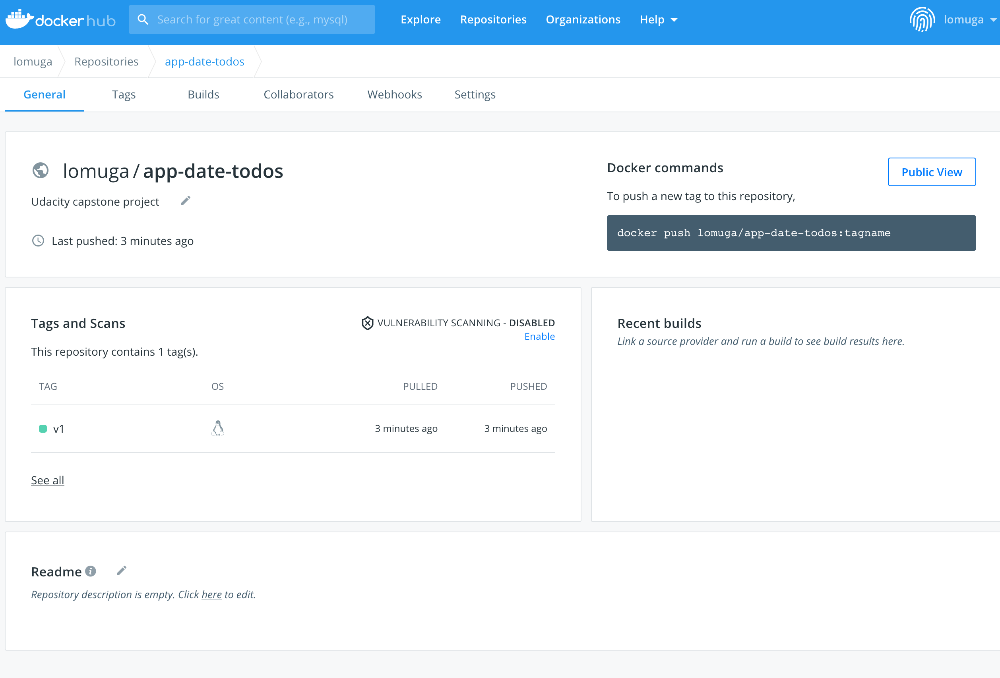
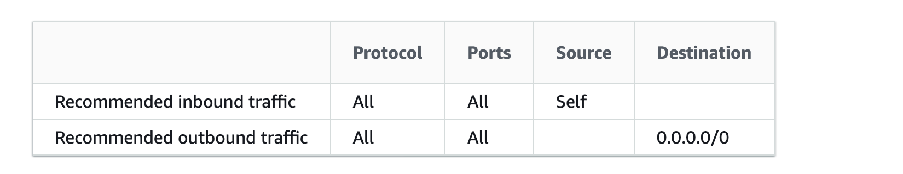

# Capstone Project: 

## Acknowledgments:

I would like to thank [Parithosh Jayanthi](https://github.com/parithosh) for his kind support during the development of this project.

## How the code is structured

### Backend

app.js - Here is all the logic. Feel free to follow the comments therein to understand the sequence of steps. It uses cookies to remember your logged-in user. It also saves data in lists.

### Frontend

Within the directory "views"

We have different .hbs files that handle different steps of the user journey.

home.hbs - it invites you to log in
login.hbs - deals with the log in  
protected - after a successful log-in, it shows the main site where you can input a date and a todo
getdata - displays the input data

## Run the app locally without docker:

	cd <folder _path>
	npm install 
	node app.js

1. Then use your browser to visit localhost:80
 
2. It will ask you for a login, you should enter **exactly**: 
for email "user@email.com" and for password "password"

3. You can safelist more users in line 11 of app.js

4. Then the website will take you to a page to enter a date and a todo

5. Once you hit submit, the app will print out the list of dates and todos

6. To input more data, press the "back" button of your browser AND refresh the page

I know, very clanky :D but the purpose of this project is to advance the knowledge of docker and kubernetes

## To run the app locally with **docker**:

First you need to start the docker daemon.
The Dockerfile is already in place

run in the terminal in the directory where docker-compose.yaml is:

	docker image prune --all

	docker-compose -f docker-compose-build.yaml build --parallel

	docker-compose up

Visit localhost:80

(In the image you see 3000 becuase this was before I changed it to 80 for Kubernetes.)

## Continuous integration

Create a Travis account https://travis-ci.org/

Connect Travis to your GitHub and input your DocckerHub secretes (If you do not have DockerHub, kindly go ahead and create an acccount)

Take the Travis.yml file from this repo: https://github.com/gonzalo-munillag/Cloud_Development_Portfolio

Create a GitHub repo with the project (include the Travis.yml and make the corresponding changes for the path)

Pull the GitHub repo. Every time you make changes locally and you push it to GitHub, Travis will automatically build and push the docker images to your DockerHub, which will be fetched by AWS' Kubernetes

## To deploy in **AWS' Kubernetes cluster**: The application runs on a cluster in the cloud

Useful links:

1. For Kubernetes to know the docker secret, follow https://kubernetes.io/docs/tasks/configure-pod-container/pull-image-private-registry/#registry-secret-existing-credentials

2. To access the app in Kubernetes externally, type loadbalancer: https://kubernetes.io/docs/tasks/access-application-cluster/create-external-load-balancer/

This is the service.yaml

apiVersion: v1
kind: Service
metadata:
  name: app-date-todos
  labels:
    service: app-date-todos
spec:
  ports:
  - port: 80
    name: "80"
    targetPort: 80
  selector:
    service: app-date-todos
  type: LoadBalancer

The security group of the cluster is by default public

3. Install kubectl and eksctl so that you can interact with the kubernetes cluster and deploy the cluster in one line from your terminal with:

	eksctl create cluster --name myCluster --region=us-east-1 --version=1.18 --nodes-min=2 --nodes-max=3

4. In order to pull images from DockerHub inside your Kubernetes cluster, you need to add your Dockerhub credentials. Run the following:

	kubectl create secret docker-registry regcred --docker-server==https://hub.docker.com/ --docker-username=<DockerrHub_ID>--docker-password=<password> --docker-email=<your_email@whatever.com>

Note that in the file deplyoment, this has been added afetr containers:

      imagePullSecrets:
        - name: regcred
      restartPolicy: Always  
     
5. You need to deploy the different .yaml files that orchestrate the application. Go to their corresponding directories and run in the terminal:

	kubectl apply -f aws-secret.yaml
	kubectl apply -f env-configmap.yaml
	kubectl apply -f deployment.yaml
	kubectl apply -f services.yaml
	

6. Access the cluster externally with this URL add69654a18524a579ed6673eded111a-1235592976.us-east-2.elb.amazonaws.com

It is provided by the load balancer

And here is the web page:

## The app can be upgraded via rolling-update

I followed this guide to avoid downtimes: https://www.stacksimplify.com/aws-eks/kubernetes-for-absolute-beginners/update-kubernetes-deployments/

First, I changed the frontend to show this instead as a title (contains Version 2)

I had to change .travis.yml and deployment.yaml:

This was version 1

Now with version 2 without downtime, you need to run 

	kubectl set image deployment/app-date-todos uapp-date-todos=lomuga/app-date-todos:v2 --record=true
	
Yes I found a typo in my deployment file :D "uapp". But that is the name of the container

7. Troubleshooting
	
Run the following command to get the list of pods.

	kubectl get pods -n amazon-cloudwatch

Run the following command and check the events at the bottom of the output.

	kubectl describe pod pod-name -n amazon-cloudwatch

Run the following command to check the logs.

	kubectl logs pod-name  -n amazon-cloudwatch
	
## User testing

Performed accessing the Kubernetes cluster, see the URL in the search bar

- Home page is displayed

- Log in works

- Input data works, I input some stuff before but now I go with I NEED TO DO MY GROCERIES

- Viewing data works

- Going back and inputing more data works. There is indeed more data stored. I went this time with I NEED TO DO MY GROCERIES 2

## A/B deployment of the application

I inspired myself from this [tutorial](https://blog.gurock.com/implement-ab-testing-using-kubernetes/) but it is not quite what I did because in their tutorial they do not have a front end.

To have access to both versions, I had to add a second port in the service

Then I changed the deployments like this

Because the newer version is subject to more traffic (Given my arbitrary context :D) I gave it 2 replicas. And the old version just one, this would depict a setting when the new version seems to work well.

I had to make the second deployment a loadbalancer, as it was not there by default. Here are the two:

You can see here that both are running different images:

And indeed both accept traffic and are running different versions. To make it more obvious I changed the titles

Future work:

You can make modifications in app.js   
You can add a new page to render the data if you like
