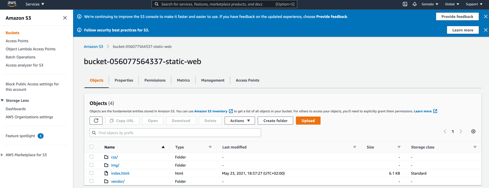
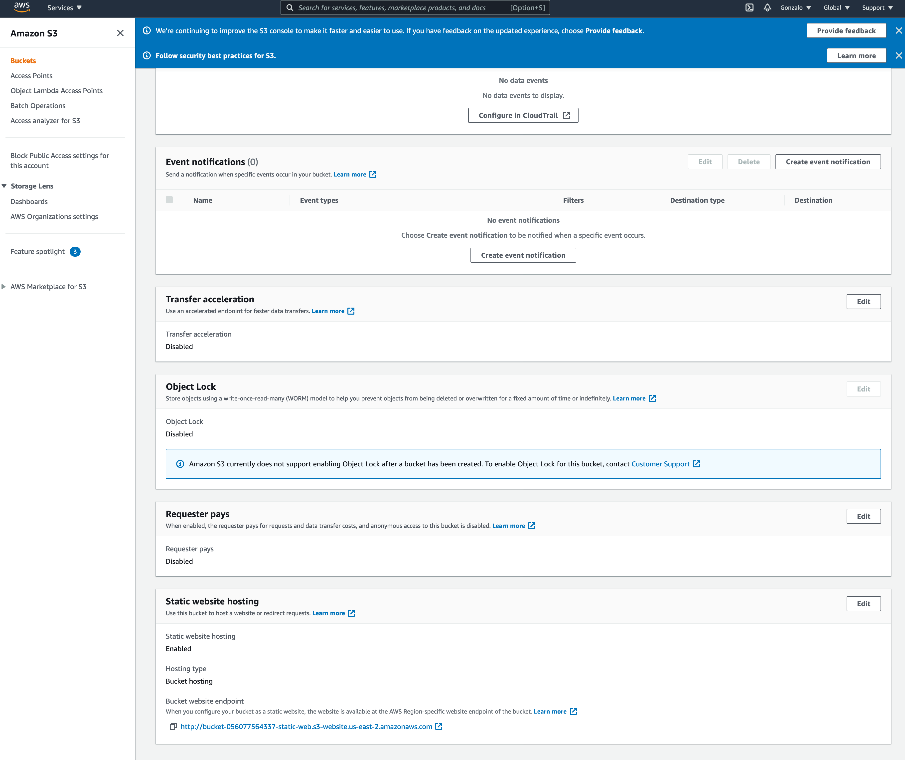
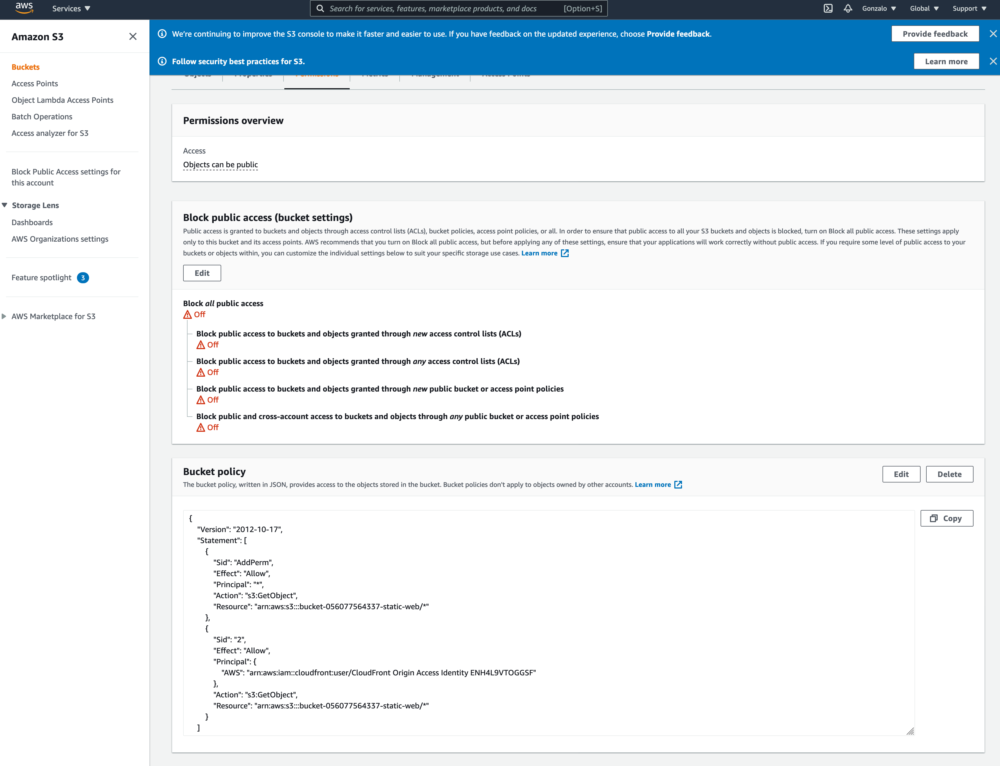
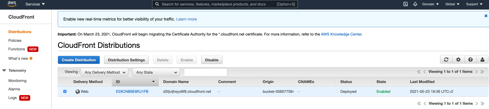

# Deploy Static Web

In this project:
-  I employed an S3 bucket to host a static website
-  I configured the bucket for such a purpose
-  I secured the bucket using IAM policies
-  I employed CloudFront to speed up content delivery

Wesbsite's URL: https://bucket-056077564337-static-web.s3.us-east-2.amazonaws.com/index.html

CloudFront enpoint: d3tjvijhsyo6f9.cloudfront.net

(The website was deployed the 23/05/2021. Some months past this date, the website will not be hosted anymore)

Here are the set of elements needed and the different settings:

